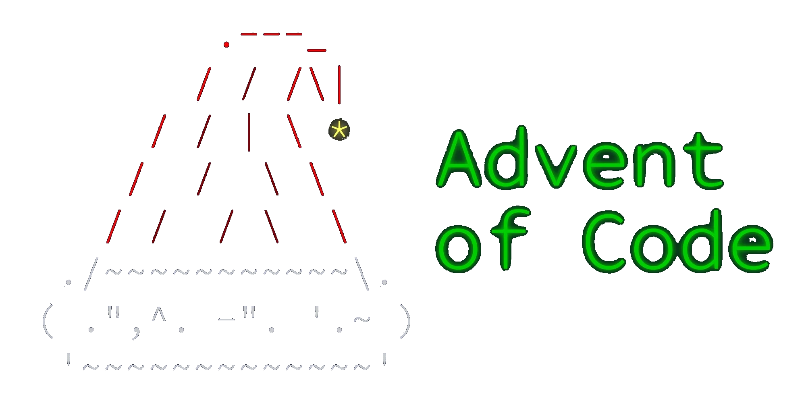

  
 

# Advent of Code 2024 Solutions

This year, out of boredom, curiosity and because i thought it would be fun, I decided to try to solve all the problems from the Advent of Code.

Here are my solutions and some personal impressions for each problem:
- Day 1: [Part 1](./solutions/day01/part1.cpp), [Part 2](./solutions/day01/part2.cpp) ✨
  - pretty basic problem involving sortings for part 1 and maps for part 2
- Day 2: [Part 1](./solutions/day02/part1.cpp), [Part 2](./solutions/day02/part2.cpp)
  - solved part 1 quickly in O(n), got stuck while trying to solve part 2 in O(n) too, ended up using the same logic as in part 1 and reached O(n^2) time complexity
- Day 3: [Part 1](./solutions/day03/part1.cpp), [Part 2](./solutions/day03/part2.cpp)
  - a problem involving lots of parsing, i honestly hated it
  - also after researching a bit about regex i came up with the following solution: [Part 2 w/ regex](./solutions/day03/part2_regex.cpp) which imo is much more elegant 🎄
- Day 4: [Part 1](./solutions/day04/part1.cpp), [Part 2](./solutions/day04/part2.cpp) 🎁
  - finally a decent problem, the solutions are pretty straightforward, just counting occurences of "XMAX" along any direction for part 1, and check for each 3x3 square if it contains an X-MAS for part 2
- Day 5: [Part 1](./solutions/day05/part1.cpp), [Part 2](./solutions/day05/part2.cpp)
  - again a problem with weird parsing, a cool observation is that there are ordering rules between any two numbers so you can just sort them according to the rules
- Day 6: [Part 1](./solutions/day06/part1.cpp), [Part 2](./solutions/day06/part2.cpp)
  - part 1 was easy, part 2 took me way too long to figure out that it's best just to use bruteforce
- Day 7: [Part 1](./solutions/day07/part1.cpp), [Part 2](./solutions/day07/part2.cpp)
  - took me a while to realise that the evaluation is left-to-right, other than that it was just a backtracking problem
- Day 8: [Part 1](./solutions/day08/part1.cpp), [Part 2](./solutions/day08/part2.cpp) ⛄
  - actually a decent problem
- Day 9: [Part 1](./solutions/day09/part1.cpp), [Part 2](./solutions/day09/part2.cpp)
  - part 1 was alright, meanwhile i spent fucking 3 hours trying to wrap my head around part 2, constantly dwelling about how should i implement it, periodically realising that i misunderstood the task and fixing bugs that led to other bugs that led to other bugs... overall this day was an absolute failure
- Day 10: [Part 1](./solutions/day10/part1.cpp), [Part 2](./solutions/day10/part2.cpp)
  - just BFS for the first part and BFS + dp or just DFS for the second part, for whatever reason i got lots of bugs again and i wasted a lot of time
- Day 11: [Part 1](./solutions/day11/part1.cpp), [Part 2](./solutions/day11/part2.cpp)
  - easy day, i had to change one character from part 1 to solve part 2
- Day 12: [Part 1](./solutions/day12/part1.cpp), [Part 2](./solutions/day12/part2.cpp)
  - actually a decent day and i also managed to solve the 2 parts in a reasonable time
- Day 13: [Part 1](./solutions/day13/part1.cpp), [Part 2](./solutions/day13/part2.cpp) 🛷
  - another decent day, i actually managed to get in the top 100 for solving part 2
- Day 14: [Part 1](./solutions/day14/part1.cpp), [Part 2](./solutions/day14/part2.cpp)
  - this day was interesing: part 1 was not a big deal, but for part 2 i actually outputed all the states of the matrix from t = 0 to t = 101 * 103 (the product of the dimensions of the matrix), because after that it becomes periodic, and i went through the file manually in order to find the Christmas tree (tip: Ctrl + F 1111...1111 as the tree will have lots of sequences of 1)
- Day 15: [Part 1](./solutions/day15/part1.cpp), [Part 2](./solutions/day15/part2.cpp) 🦌
  - not a bad problem but not a great one either, i did manage to solve part 2 quicker than others
- Day 16: [Part 1](./solutions/day16/part1.cpp), [Part 2](./solutions/day16/part2.cpp)
  - just a Dijkstra, unfortunatelly i had bugs when solving part 2
- Day 17: [Part 1](./solutions/day17/part1.cpp), [Part 2](./solutions/day17/part2.cpp)
  - it was tougher to understand what all the operations and combo operands and literal operands meant than to solve the actual problem (part 1), for part 2 it took me too long to figure out that a simple bruteforce wouldn't suffice, and the observation that we can bruteforce 3 bits at a time was really nice

##### Impressions so far:
  - Some days i have a hard time waking up and i can feel my speed and my thinking aren't 100%
  - Basically every problem can, is and probably should be solved with bruteforce
  - I make stupid implementation mistakes and i waste a lot of time figuring them out

[comment]: <> (🎅🤶❄🕯🌟🔥🥣🎶🎆👼)
